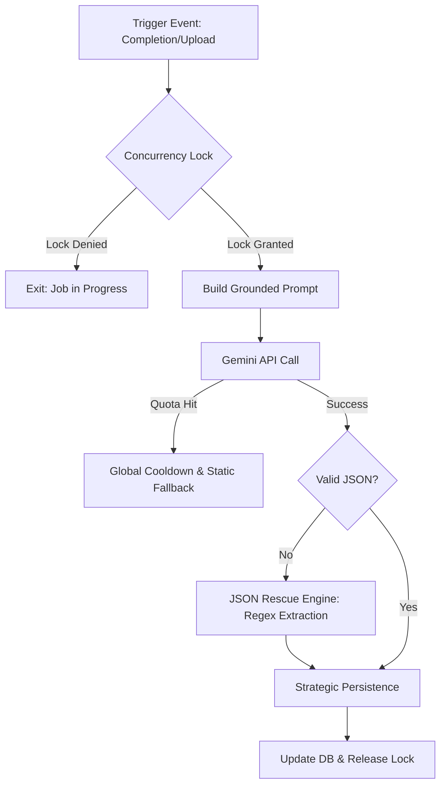

# Intelligence & AI Engine: The Strategic Brain

The AI Engine acts as the **GTM Validator's "Executive Consultant."** It doesn't just generate text; it observes the database state, audits visual files, and mutates the workspace backlog. This document provides an exhaustive reference for the platform's multi-layered AI architecture.

---

## 1. Orchestration Architecture: The "Resilient Agent"

We utilize a **Multi-Model Orchestration** strategy to balance latency, cost, and strategic depth.

-   **Gemini-2.5-Flash:** Powering fast, high-volume tasks like diagnostic insights and real-time context assistance.
-   **Gemini-Pro:** Reserved for deep strategic synthesis and complex multimodal audits of long PDF decks.

### The AI Pipeline Diagram


---

## 2. Strategic Synthesis: The Playbook Engine

The `generate_playbook_with_gemini` function in `gtm/ai_services.py` is the platform's most complex synthesis job. It converts a raw `ResultSnapshot` into a 30-day execution roadmap.

### Full Implementation: Concurrency & Persistence
```python
def generate_playbook_with_gemini(snapshot: ResultSnapshot) -> str:
    """
    1. Grounding: Pulls category scores, weak points, and user context.
    2. Concurrency: Uses a Cache-based lock to prevent duplicate API costs.
    3. Resilience: Implements the 'JSON Rescue' regex fallback.
    """
    lock_key = f"gtm:ai:playbook:{snapshot.id}:lock"
    if not cache.add(lock_key, "1", timeout=120):
        return snapshot.ai_playbook # Job already running

    try:
        prompt = _build_playbook_prompt(snapshot) # Detailed in Section 4
        client = _get_client()
        response = client.models.generate_content(model="gemini-2.5-flash", contents=prompt)
        
        # --- THE JSON RESCUE PATTERN ---
        try:
            parsed = json.loads(_clean_json_response(response.text.strip()))
            final_text = parsed.get("markdown_playbook", "")
        except Exception:
            # Fallback to Regex extraction if the AI returns malformed JSON
            match = re.search(r'["\']?markdown_playbook["\']?\s*:\s*["\']+(.*?)(?=["\'],\s*["\']|["\'],?\s*\}|$)', response.text, re.DOTALL)
            final_text = match.group(1).replace('\\n', '\n') if match else response.text

        snapshot.ai_playbook = final_text
        snapshot.ai_playbook_status = "done"
        snapshot.save()
        return final_text
    finally:
        cache.delete(lock_key)
```

---

## 3. Computer Vision: The Multimodal Auditor

The `ai_auditor.py` module handles the "Vision-to-Scoring" bridge. It critiquing visual evidence (Sales Decks, Websites) to verify self-reported scores.

### Implementation: Binary Streaming & Mapping
We stream raw bytes to the AI using `types.Part.from_bytes` to avoid the security risks and latency of public URL exposure.

```python
def perform_resource_audit(resource) -> bool:
    """
    Translates visual critique into a numeric GTM modifier.
    """
    # Step 1: Capture Raw Binary Stream
    resource.file.open('rb')
    file_bytes = resource.file.read()
    
    # Step 2: Vision Analysis
    response = client.models.generate_content(
        model='gemini-2.5-flash',
        contents=[
            types.Part.from_text("Critique this GTM asset. Return an 'Evidence Score' 1-10."),
            types.Part.from_bytes(data=file_bytes, mime_type="application/pdf")
        ]
    )

    # Step 3: Qualitative-to-Quantitative Mapping
    # Regex extracts "Evidence Score: 8" -> Modifier: +2
    score = _extract_numeric_score(response.text)
    resource.ai_score_modifier = _map_to_modifier(score)
    resource.audit_status = 'complete'
    resource.save()
```

---

## 4. Prompt Engineering: Contextual Grounding

We do not use generic prompts. Every AI interaction is "Grounded" in specific database state to ensure high-substance advice.

### Grounding Elements:
-   **Firmographics:** Industry, company size, and revenue range.
-   **Categorical Delta:** The difference between current maturity and industry benchmarks.
-   **User Context:** Raw text notes provided during the assessment are injected as "Strategic Hints" to the AI.
-   **Temporal Tracking:** The AI is informed if this is a "Re-Assessment" to highlight progress or regression.

---

## 5. Cost & Quota Infrastructure

### `AIUsageTracker`
Every API call is intercepted by this tracking utility.
-   **Granularity:** Tracks tokens by `feature_type` (playbook, audit, chat).
-   **Quotas:** If usage exceeds a 60-second moving average, the system activates a **Global Cooldown** to prevent GCP budget overruns.

### Static Fallback Engine
When the AI is unavailable (Quota hit or API down), the system automatically reverts to high-quality, pre-written advice stored in the `RecommendationBand` models. This ensures the user experience never breaks.
