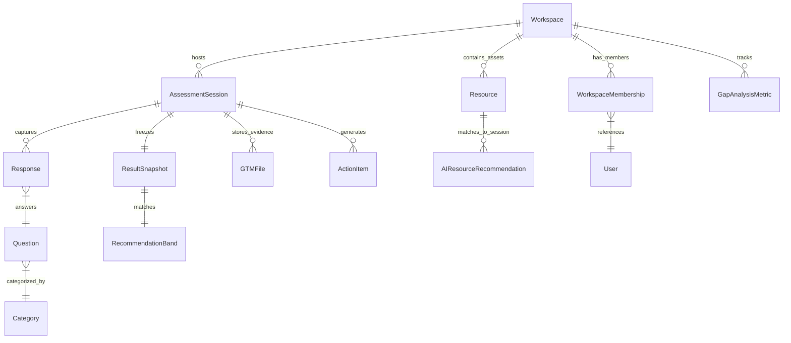

# Data Architecture & Entity Relationships

The GTM Validator uses a relational schema designed for **Strategic Immutability** and **Multi-Tenant Soft Isolation**. This document provides an exhaustive reference for the core entities and their production-grade implementations.

---

## 1. Core Lifecycle & Relationship Diagram

This diagram illustrates how an anonymous session transitions into a persistent strategic asset within a collaborative workspace.



---

## 2. Multi-Tenant Infrastructure: The Workspace Model

The `Workspace` is the top-level container for all collaborative activity. It utilizes a **Soft Isolation** pattern where objects (like Assessments or Tasks) are optionally linked to a workspace to support both private and team-based workflows.

### `Workspace` & `WorkspaceMembership`
These models handle the RBAC (Role-Based Access Control) hierarchy.

```python
class Workspace(models.Model):
    id = models.UUIDField(primary_key=True, default=uuid.uuid4, editable=False)
    name = models.CharField(max_length=100, help_text="Company/Organization name")
    slug = models.SlugField(max_length=100, unique=True)
    
    # Firmographic Data
    company_size = models.CharField(max_length=20, blank=True)
    industry = models.CharField(max_length=100, blank=True)
    
    is_active = models.BooleanField(default=True)
    created_at = models.DateTimeField(auto_now_add=True)

class WorkspaceMembership(models.Model):
    ROLE_CHOICES = [
        ('admin', 'Workspace Admin'),      # Full control
        ('manager', 'Manager'),            # Can assign tasks
        ('contributor', 'Contributor'),    # Can complete tasks
        ('viewer', 'Viewer'),              # Read-only
        ('funti3r_consultant', 'Funti3r Consultant'), # External advisor
    ]
    user = models.ForeignKey(User, on_delete=models.CASCADE)
    workspace = models.ForeignKey(Workspace, on_delete=models.CASCADE)
    role = models.CharField(max_length=20, choices=ROLE_CHOICES)
    is_active = models.BooleanField(default=True)
```

---

## 3. The Diagnostic Engine: Assessment & Response

The diagnostic engine captures user input across 36+ weighted questions.

### `AssessmentSession`
Tracks the state of a single GTM journey.
- **Acquisition Tracking:** Includes `utm_source`, `utm_medium`, and `referrer` to attribute strategic maturity to acquisition channels.
- **Identity:** Uses `owner_client_id` (UUID) to maintain state for anonymous users before they register.

### `Response`
Stores the qualitative answer (1-5) and specific business context.
- **`ai_insight`:** A JSON-capable text field where the AI stores granular feedback for low-scoring areas.
- **`context_note`:** Direct user input used as "Contextual Grounding" for the final AI Playbook.

---

## 4. Strategic Immutability: The `ResultSnapshot`

A core architectural principle of the platform is that **historical reports must never change**, even if the underlying weights or questions are updated.

### Implementation Pattern: JSON Denormalization
When an assessment is completed, we "freeze" the state into the `ResultSnapshot`.

```python
class ResultSnapshot(models.Model):
    session = models.OneToOneField("AssessmentSession", on_delete=models.CASCADE)
    overall = models.FloatField()
    
    # Strategic Immutability: Denormalized JSON
    # Stores the names, scores, and weights at the second of completion.
    category_breakdown = models.JSONField(encoder=DjangoJSONEncoder)
    
    # AI Strategy Data
    ai_playbook = models.TextField(blank=True)
    ai_financial_summary = models.TextField(blank=True)
    ai_competitor_analysis = models.TextField(blank=True)
    ai_risk_status = models.CharField(max_length=10, default="Low")
```

---

## 5. Execution & Analytics: The Dashboard Layer

The `dashboard` app tracks the translation of strategy into action.

### `GapAnalysisMetric`
Tracks the "Delta" between a company's current maturity and their desired target.
- **`metric`:** One of 6 core GTM KPIs (e.g., Win Rate, CAC Payback).
- **`priority`:** Calculated based on the size of the gap (Delta > 2.0 = High).

### `Resource` & `AIResourceRecommendation`
The asset library where strategic evidence is stored and audited.
- **`ai_score_modifier`:** An advisory impact (−5 to +5) suggested by the AI auditor based on visual evidence.
- **`gtm_categories`:** A JSON list of GTM categories (e.g., 'Lead Gen') impacted by the asset.

---

## 6. Audit & Visibility: Activity Tracking

### `WorkspaceActivityEvent`
A high-performance log of all workspace changes.
- **Purpose:** Powers the "Recent Activity" feed and enables the AI Agent to know what has changed in the workspace since its last interaction.
- **Structure:** Uses a lightweight `metadata` JSON field to store event-specific details (e.g., "Moved task X from Todo to Done").
