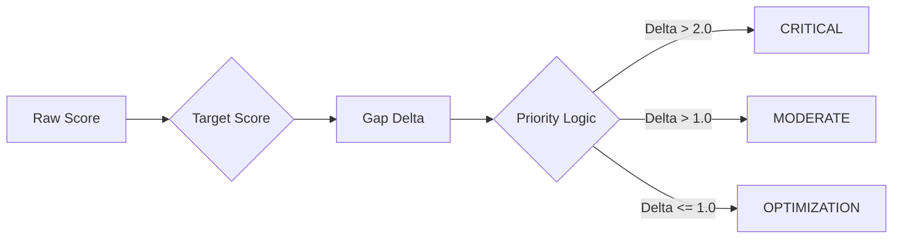

# Scoring & Analytics: The Mathematical Engine

This document provides a deep-substance reference for the GTM Validator's analytical framework. It explains how we translate qualitative assessment responses into quantitative maturity metrics and execution velocity.

---

## 1. Hierarchical Weighted Scoring

The GTM maturity score is not a simple average. It uses a **two-tier weighted index** that prioritizes strategic fundamentals over tactical execution.

### Tier 1: Question-Level Weighting
Each question carries a specific weight ($q_w$) defined in the diagnostic framework.
-   **Strategic Questions:** (e.g., ICP, Value Prop) are weighted at **1.25**.
-   **Tactical Questions:** (e.g., Tool usage) are weighted at **0.85**.

**Formula:**
$$\text{Category Score} = \frac{\sum (\text{Response}_i \times q_{w,i})}{\sum q_{w,i}}$$

### Tier 2: Categorical Normalization
Categories are weighted to reflect their impact on revenue growth.
-   **Demand Generation:** 40%
-   **Conversion / Sales:** 40%
-   **Delivery / Success:** 20%

**Implementation (SQL-Level Aggregation):**
We avoid Python loops by performing the entire aggregation in the database using Django's `Sum` and `F` expressions.

```python
# gtm/services.py - The heart of the scoring engine
def _compute_scores(session):
    category_results = (
        Response.objects.filter(session=session)
        .values('question__category_id', 'question__category__weight')
        .annotate(
            total_weighted_score=Sum(F('score') * F('question__weight')),
            total_weight=Sum('question__weight')
        )
    )
    # Final normalization to a 100-point scale
    overall += (cat_avg / 5.0) * (cat_weight / total_global_weight) * 100.0
```

---

## 2. The Analytics Engine: Execution Velocity

Execution speed is the primary driver of GTM success. The dashboard tracks how fast a workspace moves from "Strategy" to "Done."

### Action Item Velocity
We measure the efficiency of the GTM team by calculating the average days between a task's creation and its completion.

**Formula:**
$$\text{Velocity (Days)} = \frac{\sum (\text{Completed At} - \text{Created At})}{N_{completed}}$$

### Momentum Metrics (Weekly Trends)
The system identifies "Momentum" by comparing this week's performance against the previous 7 days.

| Metric | Sentiment Logic | Why? |
| :--- | :--- | :--- |
| **Sessions** | Increase is Positive | Indicates more strategic planning activity. |
| **Completed Items** | Increase is Positive | Indicates higher execution throughput. |
| **Pending Items** | **Decrease is Positive** | Indicates the team is clearing the backlog faster than it grows. |

```python
# dashboard/analytics.py logic
if last_week_pending > 0:
    raw_change = ((this_week_pending - last_week_pending) / last_week_pending) * 100
    pending_change_positive = raw_change < 0  # A decrease is GOOD for pending items
```

---

## 3. Gap Analysis & Prioritization

The platform automatically identifies the "Critical Path" for improvement using delta-based prioritization.



### Visual Property Mapping
The `calculate_gap_metric_display_properties` function maps numeric deltas to visual UI elements:
-   **High Priority:** Gaps representing > 40% of the target are flagged for immediate action.
-   **Trend Analysis:** Compares the `current` score against the `target` to generate the `progress_percentage` shown in the dashboard.

---

## 4. Vision-to-Scoring Bridge

Unique to this platform is the **Multimodal Modifier**. Qualitative visual audits (Sales Decks, Websites) are mathematically injected into the numeric maturity score.

-   **Auditor Pass:** AI generates an "Evidence Score" (1-10).
-   **Modifier Logic:**
    -   Score 1-3 $\rightarrow$ **-3% Overall Score** (Strategic disconnect).
    -   Score 8-10 $\rightarrow$ **+3% Overall Score** (Best-in-class validation).

This ensures that a company's GTM rating is **evidence-backed**, not just self-reported.

---

## 5. Revenue Attribution Analytics

The system ties GTM maturity to financial performance by tracking revenue distribution across channels (e.g., SEO, Paid, Referrals).

-   **Revenue Percent:** $(\text{Channel Revenue} / \text{Total Revenue}) \times 100$.
-   **Correlation:** By overlaying the **Conversion Category** score against **Paid Search ROI**, the platform identifies whether high CAC is a marketing problem or a sales execution problem.
