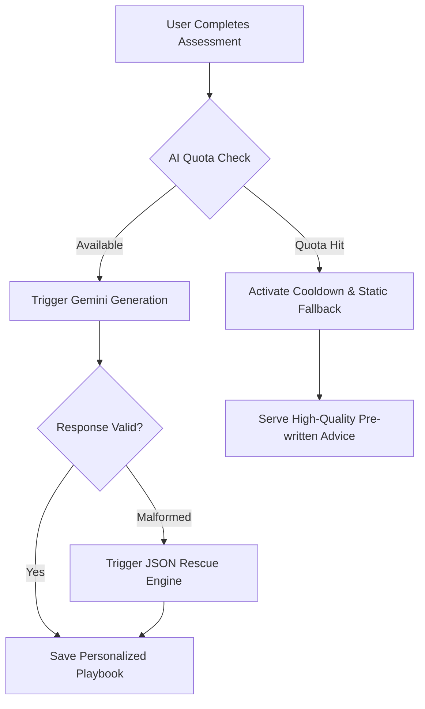
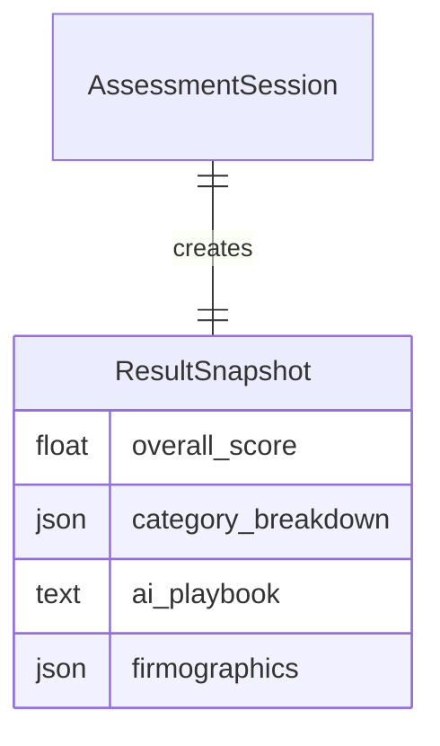

# System Design Logic: The Engineering Philosophy

This document outlines the architectural decisions and engineering principles that power the GTM Validator. It maps business goals to technical implementations, providing a high-substance reference for the platform's "Modern Monolith" design.

---

## 1. The "Resilient Consultant" Architecture

**Goal:** Provide 24/7 strategic advice despite the inherent latency and unreliability of external AI APIs.

### AI Processing Flow & Fallback Strategy
We use a **Layered Resilience** model. If the primary AI (Gemini) is slow or reaches quota, the system automatically degrades gracefully without breaking the user experience.

### Technical Rationale: Distributed Locking
To prevent "Quota Storms" where multiple users trigger simultaneous AI requests, we implement a **Global Quota Cooldown** in the cache layer. If a `ResourceExhausted` error is caught, the platform pauses all AI calls for 5 minutes, ensuring we stay within enterprise rate limits while serving pre-written "Safe Mode" content.

---

## 2. The "Modern Monolith" UI Strategy

**Goal:** Deliver a "Single Page App" (SPA) feel without the complexity and "hydration" lag of a heavy JavaScript framework like React or Vue.

### HTMX-Django Synergy
We leverage **HTMX** to handle high-interactivity components (like the multi-step assessment wizard and the Kanban board) while keeping 100% of the business logic in Python.

-   **Logic:** The view detects the `HX-Request` header.
-   **Implementation:** It returns only the required HTML partial rather than the full base template.
-   **Benefit:** Zero client-state management and a dramatically simplified testing suite. The "Single Source of Truth" remains the Django model.

---

## 3. Data Integrity: The "Snapshot" Pattern

**Goal:** Ensure that strategic reports are immutable. A GTM strategy from six months ago must not change if the diagnostic questions are updated today.

### Strategic Immutability
Instead of linking `Results` to the current `Question` objects, we use the `ResultSnapshot` model to **denormalize** the state of the business at the time of completion.

### Implementation Detail
The `category_breakdown` is stored as a JSON blob containing the names, scores, and weights at the exact second the assessment was finished. This allows us to evolve our diagnostic framework (adding/removing questions) without corrupting historical audit trails.

---

## 4. Multi-Tenant "Soft" Isolation

**Goal:** Enable team collaboration (Workspaces) while maintaining a seamless path for anonymous "Guest" users.

### The RBAC Hierarchy
Security is enforced through a hierarchical authorization check (`safe_get_session_or_403`) rather than rigid row-level security. This allows the system to be "Soft" enough for guest users but "Hard" enough for enterprise workspaces.

1.  **Direct Owner:** The `User` who created the session.
2.  **Workspace Member:** Any user with an active membership in the session's workspace.
3.  **Anonymous Owner:** Verified via a browser-scoped `client_id` cookie.

---

## 5. Vision-to-Scoring Pipeline

**Goal:** Transition from subjective self-reporting to objective evidence-based validation.

### Multimodal Pipeline
The AI Auditor acts as a "Secondary Grader." It analyzes visual evidence (PDF decks, Landing Page screenshots) to verify the claims made in the diagnostic survey.

-   **Input:** Raw binary bytes (not URLs) are streamed to Gemini-Flash.
-   **Logic:** The AI generates a 1-10 "Evidence Score."
-   **Output:** The system maps this score to a **Numeric Modifier** (-3 to +3) which is mathematically injected into the final GTM score.

---

## 6. Token-Aware Cost Management

**Goal:** Maintain SaaS profitability by tracking AI costs at the granular level.

### Usage Monitoring
Every AI call (Playbook, Audit, Insight) is intercepted by the `AIUsageTracker`.
-   **Granularity:** Logs input/output tokens per feature and per workspace.
-   **Proactive Guardrails:** Administrators can see cost trends in real-time and adjust feature accessibility (e.g., limiting Chat usage for free-tier workspaces).
